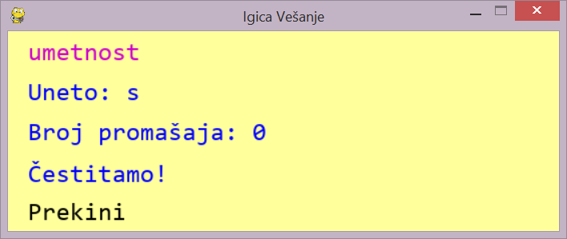

# Pygame


```
import pygame #uvoz biblioteke

pygame.init()  

SCREEN_WIDTH = 250
SCREEN_HEIGHT = 60

#pravljenje prozora igrice
screen = pygame.display.set_mode((SCREEN_WIDTH, SCREEN_HEIGHT)) 
screen.fill((255,255,255))  
pygame.display.set_caption("Uvodni primer")

pygame.display.update()

#cekanje odredjenog vremena pre zatvaranja prozora
pygame.time.wait(5000) 

pygame.quit()


```
	
## Bitne funkcije

* pygame.init() - inicijalizacija modula
* pygame.display.set_mode((SCREEN_WIDTH, SCREEN_HEIGHT)) - inicijalizacija prozora za prikazivanje i zadavanje veličine istog
* screen.fill(color) - postavljanje boje pozadine
* pygame.display.set_caption(text) - postavljanje naslova prozora
* pygame.display.update() - ažuriranje prozora
* pygame.quit() -  oslobađa sve pygame module


## Priкaz teksta

* modul: pygame.font
* font.SysFont(name, size, bold=False, italic=False) - pravi objekat klase Font korišćenjem sistemskih fontova 
* Font.render(text, antialias, color, background=None) - prikaz teksta na površini (Surface)
	* ako je antialias postavljen na True, karakteri će imati glatke ivice


## Površine (Surface)

* objekat za predstavljanje slika
* Surface.blit(source, dest) 
  * crta jednu površinu (source) u površinu koja je pozvala metod
  * dest je gornji levi ugao pravugaonika u koji će biti iscrtana prosleđena površina
* Surface.set_colorkey(color) - pikseli površine sa zadatom bojom će biti transparentni
* Surface.get_width() - vraća širinu površine
* Surface.get_height() - vraća visinu površine
* Surface.get_rect() - vraća pridruženi pravugaonik	
	* vraća objekat klase Rect

## Pravugaonik (Rect)

* objekat za čuvanje koordinata pravugaonika
	* Rect(left, top, width, height) 
 	* Rect((left, top), (width, height)) 
* pygame koristi Rect objekte za čuvanje i manipulaciju pravugaonih oblasti 
* neki od atributi koji mogu da se koriste radi pomeranja   
 	* topleft, bottomleft, topright, bottomright
 	* center, centerx, centery
 	* size, width, height
* Rect.collidepoint(x, y) - proverava da li je zadata tačka u pravugaoniku 
 	* vraća vrednost tipa bool


## Obrada događaja 

* Događaji - pomeranje miša, pritisak na dugme miša ili tastera na tastaturi 
* modul: pygame.event
* pygame.event.get() - red događaja
* potrebno je u kodu obezbediti i obradu različitih događaja (event handler)
* Svaki događaj ima pridruženi tip (type)  
	* pritisak tastera pripada tipu KEYDOWN
	* zatvaranje prozora tipu QUIT
	* otpuštanje dugmića na mišu ima tip MOUSEBUTTONUP 
* Svaki tip može imati i dodatne pridružene podatke, npr. KEYDOWN ima pridruženu promenljivu *key* koja sadrži informaciju koji taster je pridružen. 
	* pygame.locals - sadrži imenovane konstante za svaki  taster. Može im se pristupiti sa pygame.*CONSTANT*  ili se uključuju preko modula locals i pozivaju sa *CONSTANT* (npr. K_LEFT, K_RIGHT, K_UP, K_DOWN, K_a, K_b)
* pygame.mouse - modul za rad sa mišem
	* mouse.get_pos() - vraća uređeni par koordinata na kojoj se trenutno nalazi pokazivač miša. 
* pygame.key - modul za rad sa tastaturom
	* key.get_pressed() - vraća torku elemenata čiji se elementi koriste kao logičke vrednosti koje pokazuju da li je određeni taster pritisnut ili nije 
* event.unicode - atribut koji sadrži karaker koji je pridružen pritisnutom tasteru


## Petlja igrice

```
running = True

while running:
	...
	
```
* Za kontrolu igirce koristi se petlja. Petlja igrice radi sledeće
	* obrađuje ulaz korisnika
	* ažurira stanje svih objekata igrice
	* ažurira prikaz i audio izlaz
	* upravlja brzinom igrice
* Svaki ciklus u petlji igrice je frejm. 
* Frejmovi se smenjuju dok se ne ispuni neki uslov za kraj igrice.

## Zadaci


1. Napisati program koji pravi prozor veličine 250x60 i prikazuje tekst koji se unosi preko tastature. 
2. Napisati program koji pravi prozor veličine 250x60 i prikazuje tekst koji se unosi preko tastature. Obezbediti i prikaz teksta **Prekini**. Kada korisnik klikne na tekst **Prekini** prozor se zatvara.

3. Napraviti igru **Vešanje** u kojoj je potrebno da korisnik pogodi zadatu reč. Potrebno je da prozor igrice izgleda kao na slici



Obezbediti sledeće funkcionalnosti u igrici:
* Reč za pogađanje (u primeru umetnost) se prvo prikazuje pomoću karaktera *, tj. prikazuje se karakter * onoliko puta koliko ima slova u reči za pogađanje. 
* U prozoru se prikazuje svaki karakter koji korisnik unese preko tastature (na primeru *Uneto: s*).
* Ukoliko zadati karakter postoji u reči za pogađanje, to slovo se i prikazuje umesto * u okviru prikaza reči za pogađanje.
* Prikazuje se broj karaktera koje je korisnik zadao, a koje ne postoje u reči zadatoj za pogađanje, tj. prikazuje se broj promašaja.
*  Obezbediti i prikaz teksta **Prekini**. Kada korisnik klikne na tekst **Prekini** prozor se zatvara.
*   Kada korisnik klikne na dugme za zatvaranje prozora, prozor se zatvara.
*  Kada korisnik pogodi reč na prozoru se ispisuje poruka *Čestitamo!*

