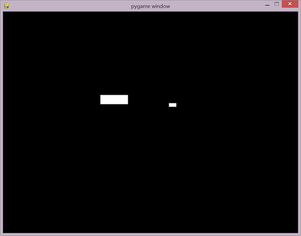
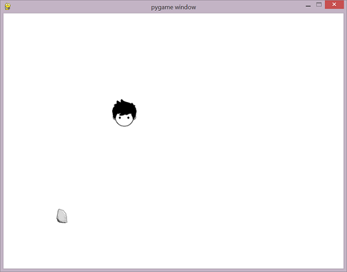

# Pygame


```
import pygame #uvoz biblioteke

pygame.init()  

SCREEN_WIDTH = 250
SCREEN_HEIGHT = 60

#pravljenje prozora igrice
screen = pygame.display.set_mode((SCREEN_WIDTH, SCREEN_HEIGHT)) 
screen.fill((255,255,255))  
pygame.display.set_caption("Uvodni primer")

pygame.display.update()

#cekanje odredjenog vremena pre zatvaranja prozora
pygame.time.wait(5000) 

pygame.quit()


```
	
## Bitne funkcije

* pygame.init() - inicijalizacija modula
* pygame.display.set_mode((SCREEN_WIDTH, SCREEN_HEIGHT)) - inicijalizacija prozora za prikazivanje i zadavanje veličine istog
* screen.fill(color) - postavljanje boje pozadine
* pygame.display.set_caption(text) - postavljanje naslova prozora
* pygame.display.update() - ažuriranje prozora
* pygame.quit() -  oslobađa sve pygame module


## Površine (Surface)

* objekat za predstavljanje slika
* Surface.blit(source, dest) 
  * crta jednu površinu (source) u površinu koja je pozvala metod
  * dest je gornji levi ugao pravugaonika u koji će biti iscrtana prosleđena površina
* Surface.set_colorkey(color) - pikseli površine sa zadatom bojom će biti transparentni
* Surface.get_width() - vraća širinu površine
* Surface.get_height() - vraća visinu površine
* Surface.get_rect() - vraća pridruženi pravugaonik	
	* vraća objekat klase Rect

## Pravugaonik (Rect)

* objekat za čuvanje koordinata pravugaonika
	* Rect(left, top, width, height) 
 	* Rect((left, top), (width, height)) 
* pygame koristi Rect objekte za čuvanje i manipulaciju pravugaonih oblasti 
* neki od atributi koji mogu da se koriste radi pomeranja   
 	* topleft, bottomleft, topright, bottomright
 	* center, centerx, centery
 	* size, width, height
* collidepoint(x, y) - proverava da li je zadata tačka u pravugaoniku 
 	* vraća vrednost tipa bool
* move_ip(x, y) - pomera pravugaonik za *x* po širini i *y* po dužini 

## Sprajtovi (Sprite)

* modul: pygame.sprite
* klasa za upravljanje i iscrtavanje objekata igrice 
* add(x) - za dodavanje sprajta u neku grupu
* remove(x) - za brisanje sprajta iz neke grupe
* alive() - za proveru da li sprajt pripada nekoj grupi; ako pripada metod vraća True
* kill() - za brisanje sprajta iz svih grupa 
* update() - metod za upravljanje ponašanjem sprajta

## Grupa sprajtova (Group)

* modul: pygame.sprite
* klasa se koristi za grupisanje različitih sprajtova 
* add(x) - za dodavanje sprajta u  grupu
* remove(x) - za brisanje sprajta iz grupe
* empty() - za brisanje svih sprajtova iz grupe
* sprites() - vraća listu sprajtova u grupi
* update() - poziva metod *update* svakog sprajta u grupi
* draw(Surface) - iscrtavanje svih sprajtova u površinu koja je zadata kao argument

## Funkcije za obradu kolizije (Group)

* modul: pygame.sprite
* spritecollide(sprite, group, dokill) - provera da li postoji kolizija između sprajta *sprite* i sprajtova u grupi *group*. Ako postoji, kao rezultat vraća listu sprajtova sa kojom je glavni sprajt u koliziji. Sa parametom *dokill*  se zadaje da li je potrebno pozvati metod *kill* za sve sprajtove u grupi sa kojima je glavni sprajt u koliziji.
 
* groupcollide(group1, group2, dokill1, dokill2) -  provera da li postoji kolizija između sprajtova u grupi *group1* i sprajtova u grupi *group2*. Ako postoji, kao rezultat vraća rečnik čiji ključevi predstavljaju sprajtove iz grupe 1 koji su u koliziji sa nekim sprajtovima iz grupe 2, a pridružena vrednost ključu je lista sprajtova iz grupe 2 sa kojima je ključ u koliziji. Sa parametom *dokill1*  se zadaje da li je potrebno pozvati metod *kill* za sve sprajtove u grupi 1 koji su u koliziji sa nekim sprajtom iz grupe 2. Sa parametom *dokill2*  se zadaje da li je potrebno pozvati metod *kill* za sve sprajtove u grupi 2 koji su u koliziji sa nekim sprajtom iz grupe 1.
* spritecollideany(sprite, group) - provera da li je glavni sprajt *sprite* u koliziji sa bar jednim sprajtom u grupi *group*

## Zvuk

* pygame.mixer - modul za rad sa zvukom
* Sound - klasa za rad sa audio sadržajem
	* kao prametar konstruktora zadaje se putanja do audio datoteke
	* play() - puštanje učitanog zvuka


## Obrada događaja 

* Događaji - pomeranje miša, pritisak na dugme miša ili tastera na tastaturi 
* modul: pygame.event
* pygame.event.get() - red događaja
* potrebno je u kodu obezbediti i obradu različitih događaja (event handler)
* Svaki događaj ima pridruženi tip (type)  
	* pritisak tastera pripada tipu KEYDOWN
	* zatvaranje prozora tipu QUIT
	* otpuštanje dugmića na mišu ima tip MOUSEBUTTONUP 
* Svaki tip može imati i dodatne pridružene podatke, npr. KEYDOWN ima pridruženu promenljivu *key* koja sadrži informaciju koji taster je pridružen. 
	* pygame.locals - sadrži imenovane konstante za svaki  taster. Može im se pristupiti sa pygame.*CONSTANT*  ili se uključuju preko modula locals i pozivaju sa *CONSTANT* (npr. K_LEFT, K_RIGHT, K_UP, K_DOWN, K_a, K_b)
* pygame.mouse - modul za rad sa mišem
	* mouse.get_pos() - vraća uređeni par koordinata na kojoj se trenutno nalazi pokazivač miša. 
* pygame.key - modul za rad sa tastaturom
	* key.get_pressed() - vraća torku elemenata čiji se elementi koriste kao logičke vrednosti koje pokazuju da li je određeni taster pritisnut ili nije 
* event.unicode - atribut koji sadrži karaker koji je pridružen pritisnutom tasteru

# Korisnički definisani događaji

* pygame.USEREVENT sadrži vrednost koja može da se dodeli korisnički definisanom tipu
*pygame.time.set_timer(event, millis) - za pravljenje događaja *event* na svakih *millis* milisekundi
	* *event* može biti objekat klase pygame.event.Event ili ceo broj koji označava korisnički definisan događaj

## Petlja igrice

```
running = True

while running:
	...
	
```
* Za kontrolu igirce koristi se petlja. Petlja igrice radi sledeće
	* obrađuje ulaz korisnika
	* ažurira stanje svih objekata igrice
	* ažurira prikaz i audio izlaz
	* upravlja brzinom igrice
* Svaki ciklus u petlji igrice je frejm. 
* Frejmovi se smenjuju dok se ne ispuni neki uslov za kraj igrice.

## Iscrtavanje geometrijskih objekata
* modul: pygame.draw
* draw.rect(surface, color, rect, width=0) - iscrtava pravugaonik
	* width=0 označava da se pravugaonik popunjava bojom. Ako je width>1 onda se crta samo ivica, a zadata vrednost predstavlja njenu debljinu
* draw.circle(surface, color, center, radius, width=0) - iscrtava krug
* draw.arc(surface, color, rect, start_angle, stop_angle) - iscrtava luk	

## Zadaci


1. Napraviti igru **Bežanje od neprijatelja** u kojoj je korisnik predstavljen kao veliki pravugaonik, a neprijatelji kao mali pravugaonici.
Obezbediti sledeće funkcionalnosti u igrici:
* Novi neprijatelj nastaje na svakih 250 milisekundi. 
* Neprijatelji se kreću pravolinijski sa desna na levo. 
* Početna pozicija na y koordinati neprijatelja se slučajno određuje. 
* Igrač se po sceni pomera pomoću tastera gore, dole, levo i desno.
* Kada neprijatelj udari korisnika igra se završava.




2. Izmeniti igru **Bežanje od neprijatelja**
tako da bude  **Bežanje od kamenica**.  Korisnika (igrača) predstaviti kao dečaka, a neprijatelja kao kamen. Kada kamen udari dečaka pustiti zvuk udarca i završiti igru. 




 